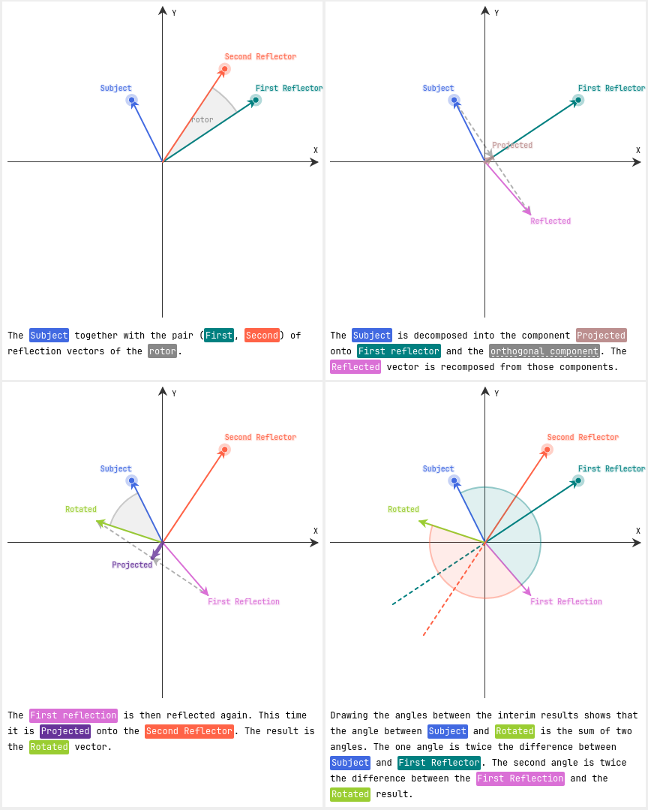

# Rotation via double Reflection

This is a demonstration how any rotation of a vector <code
  class="name-s">s</code> can be achieved by two successive reflections.

A reflection of vector <code class="name-s">s</code> at vector
<code class="name-u">u</code> is achieved by first projecting
<code class="name-s">s</code>
onto <code class="name-u">u</code> and then adding the difference betwen
<code class="name-s">s</code> and the projection.

A reflection of vector <code class="name-s">s</code> at vector
<code class="name-u">u</code>
followed by a reflection at vector <code class="name-v">v</code> results
in a rotation of <code class="name-s">s</code> in the plane spanned by
vectors
<code class="name-u">u</code>
and
<code class="name-s">v</code>.

The angle of the rotation is twice as large as the angle between vector <code
  class="name-u">u</code>

and vector
<code class="name-v">v</code>.

In general to construct a rotation of angle
<code class="name-alpha">&alpha;</code>
you just need to construct two vectors that enclose an angle
<code><code class="name-alpha">&alpha;</code> / 2</code> and then use them
as reflectors for the subject vector.

The pair of vector <code class="name-u">u</code> and
<code class="name-s">v</code>
is called a rotor.

Notice that only the relative orientation between
<code class="name-u">u</code>
and <code class="name-s">v</code>
affect the rotation result. Try drag the arc segment called
<code class="name-rotor">rotor</code> below to change the direction of both
reflectors at once.

[Live Demo](https://static.laszlokorte.de/rotor-reflect/)
